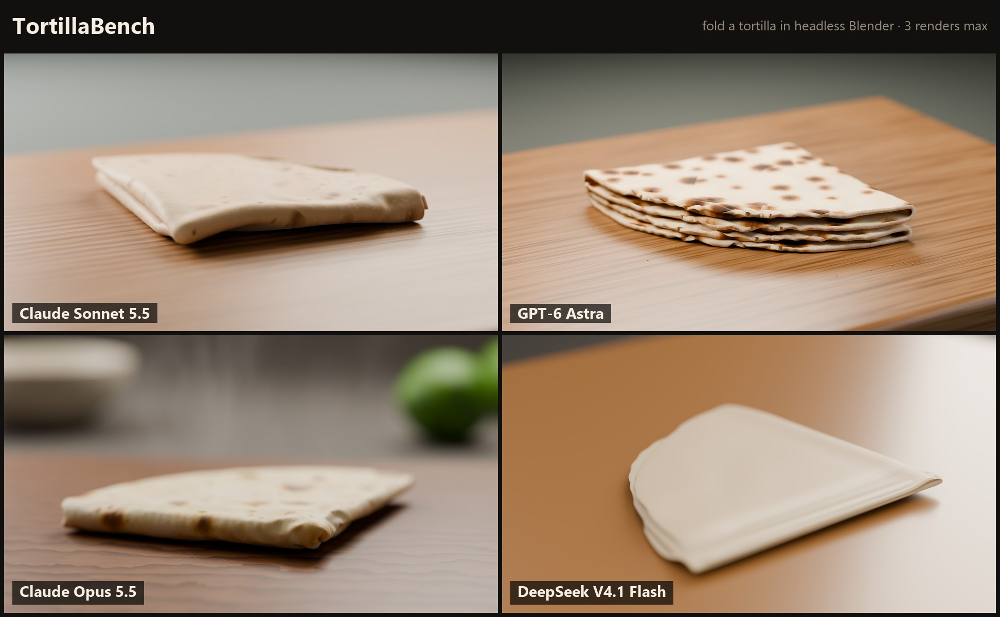
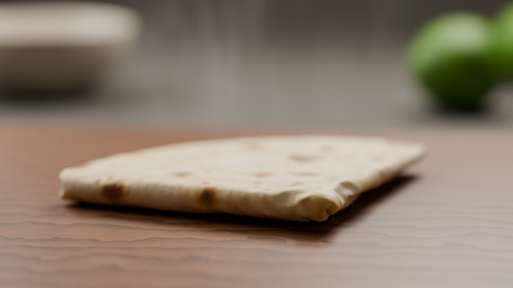
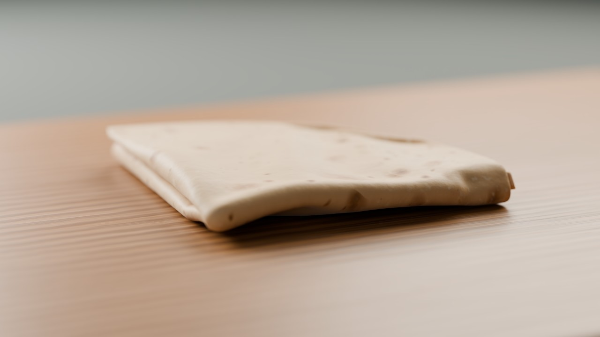
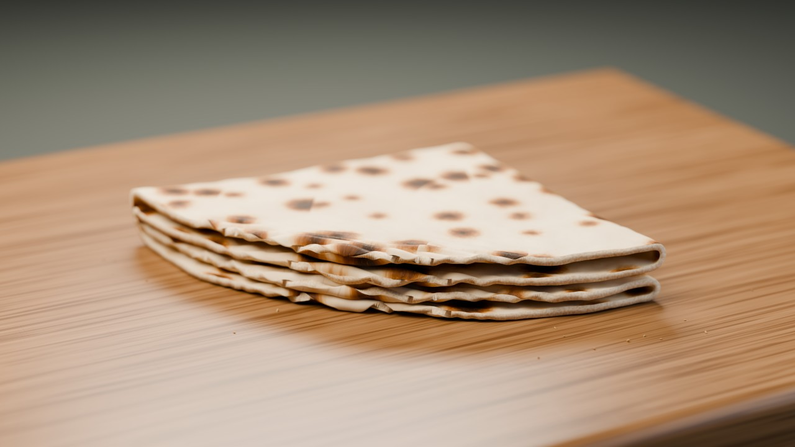

# 🌮 TortillaBench

**Can your model fold a tortilla?**

One task: using only headless Blender and one Python script, build, cloth-simulate, shade, light, and render a photorealistic warm flour tortilla folded into quarters on a wooden cutting board. No GUI, no external assets, no HDRIs, and only **three renders** to get it right.

It's a fun benchmark covering 3D modeling, physics, procedural materials, photography, and the model's ability to critique its own work. The full spec is in [`TASK.md`](TASK.md).



**Round 1** (October 2026): four models, the same prompt, and the same cloud RTX 5090. Every run used 3 of 3 renders.

| Model | Agent | Cloud calls | GPU time | Notes |
|---|---|---|---|---|
| GPT-6 Astra | Codex | 3 | ~0.9 h | Cleanest layered fold and the strongest char spots |
| Claude Opus 5.5 | Claude Code | 33 | ~9.7 h | About 30 simulation-only bakes to solve the second fold; the only run that added props and steam |
| DeepSeek V4.1 Flash | pi | 34 | ~1.7 h | Six shader links dropped before the last render, so the materials came out flat (the model caught and reported this itself) |
| Claude Sonnet 5.5 | Claude Code | — | — | Ran before cloud rendering existed, on local Blender |

## Gallery

<!-- gallery:start -->
| Final render | Model | Date | Grade | Run |
|---|---|---|---|---|
|  | **Claude Opus 5.5**<br>claude-code | 2026-10-04 | not graded | [files](results/claude-opus-5.5/2026-10-04) |
|  | **Claude Sonnet 5.5**<br>claude-code | 2026-09-29 | not graded | [files](results/claude-sonnet-5.5/2026-09-29) |
|  | **DeepSeek V4.1 Flash**<br>pi | 2026-10-05 | not graded | [files](results/deepseek-v4.1-flash/2026-10-05) |
|  | **GPT-6 Astra**<br>codex | 2026-10-04 | not graded | [files](results/gpt-6-astra/2026-10-04) |
<!-- gallery:end -->

## Run it on a model

Blender runs on a cloud GPU ([Daytona](https://www.daytona.io/) spot RTX 5090/4090 with Blender 4.5 LTS), so every model renders on identical hardware and your machine stays out of it.

**One-time setup**

```bash
python -m venv .venv
.venv/Scripts/pip install daytona          # .venv/bin/pip on macOS/Linux
echo DAYTONA_API_KEY=... > .env            # gitignored; optionally add DAYTONA_ORGANIZATION_ID
```

**Each run** happens in its **own workspace outside this repo**, so the model can't peek at other models' tortillas:

```bash
# 1. Make an isolated workspace (TASK.md, RENDERING.md, render.py)
python tortilla.py new "claude-opus-5-5"
# -> ~/tortillabench-runs/claude-opus-5-5-2026-10-04

# 2. Start your agent *in that folder* and give it the prompt below

# 3. Collect the run (this also kills its cloud sandboxes), then rebuild the gallery
python tortilla.py collect ~/tortillabench-runs/claude-opus-5-5-2026-10-04 --model "Claude Opus 5.5" --harness claude-code
python tortilla.py gallery

# Anytime: destroy every TortillaBench sandbox and verify (prints "still alive: 0")
python tortilla.py kill
```

### Agent prompt

```text
Read TASK.md and RENDERING.md in this folder. TASK.md is the complete spec;
RENDERING.md explains how to run Blender (always through render.py, which
runs it on a cloud GPU). Complete the task, keeping every file you create
inside this folder, and finish by writing REPORT.md covering all the
deliverables.
```

Inside the workspace, the model runs Blender like this:

```bash
python render.py build_tortilla.py [-- script args]
```

That runs exactly `blender --background --factory-startup --python build_tortilla.py` in a fresh sandbox, streams the log, downloads everything the script wrote, then destroys the sandbox and verifies it's gone. Startup takes about 2 minutes. Each sandbox also has a 60-minute TTL as a fuse, so nothing outlives a crashed session.

Every call is logged to `cloud_logs/` and `cloud_runs.json`. That gives the grader an exact count of how many renders the model really used, and `meta.json` gets a GPU-time and cost summary.

There's no other enforcement: the model uses its tools however it likes, and the grader reads what it leaves behind.

`collect` copies the whole workspace. It skips the harness files, `.blend1` backups, byte-identical duplicates, and all but the newest `.blend`. It then writes `meta.json` and a small `preview.jpg` for the gallery. It guesses the final render (the newest full-size image); use `--final path/to/image.png` if it guesses wrong.

## Grading

Runs are graded later by an LLM judge using [`GRADING.md`](GRADING.md). The judge gets the final render, the iteration renders, the script, and the report, and its scores go in the `grade` field of `meta.json`.

## Submitting results

Open a PR that adds your `results/<model>/<date>/` folder, exactly as `collect` produced it. Failed runs are welcome too; the disasters are half the fun.

## License

[MIT](LICENSE). This covers everything: the task, the scripts, and the results. Fork it, remix it, and put it in your paper or your tweet.
