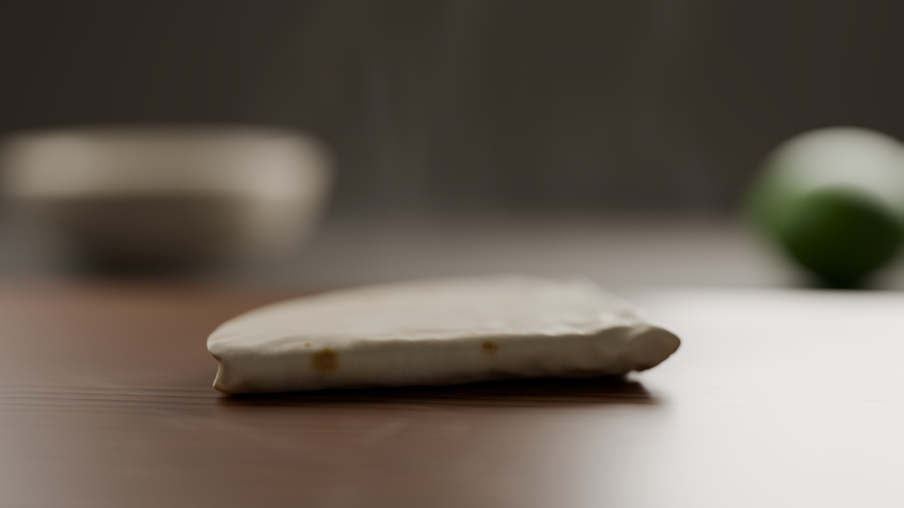
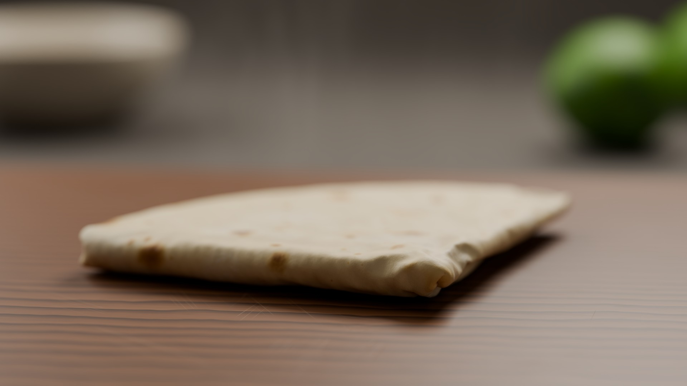

# Iteration log — PROCEDURAL-PHOTOREAL-01 (folded flour tortilla)

Every cloud execution is recorded by `render.py` in `cloud_runs.json` with its full stdout in `cloud_logs/`.
Hardware for all runs: Daytona spot sandbox, NVIDIA GeForce RTX 5090, 8 vCPU / 16 GB, Blender 4.5.13 LTS (Linux).

Render budget: **3 renders max**. Bake-only runs (`--bake-only`) build the full scene, run and bake the
cloth simulation and save the .blend, but never call the renderer, so they don't count toward the limit
(rule I4). They are logged below. To check the cloth result between bakes I exported the simulated cloth
mesh as OBJ and plotted it locally with matplotlib (`tools/analyze_sim.py` → `bakes/*/sim_qa.png`): plain
top and side projections of the triangles, not a render.

## Bake-only runs (simulation development, no image rendered)

| # | cloud log | change tested | result |
|---|-----------|---------------|--------|
| B1 | `001_*` | first full pipeline: rim-region pin (outer 45 % of flap) rotated 180° by hook, bending 5 | Pipeline OK end to end. Folds failed: the 6 cm free strip between hinge and pinned rim buckled into an S mid-fold and the folded tortilla piled up 45–60 mm high. |
| B2 | `002_*` (gateway error, retried) / `003_*` | bending 5 → 0.8, hinge axis shifted into the flap | Same S-buckle at frame 40 → bending stiffness is not the limiting factor. Pile still 74 mm high. |
| B3 | `004–006_*` (3 parallel, fold 1 only) | self-collision off / self distance 0.5 mm / 0.8 mm | No-self run still made a 28 mm tent, so collision isn't the main cause. 0.5 and 0.8 mm gave identical results, which points to a 1 mm floor on `self_distance_min`. Diagnosis: the free strip acts as a column carrying its own weight while the flap is vertical, so it buckles and the excess material ends up in the fold. |
| B4 | `007_*` | **new fold strategy:** pin the whole flap except a narrow hinge band (≈ π·loop radius wide) and swing it rigidly about an axis at the band centre, raised by the loop radius; release and drape in the settle stage | **Fold 1 now works:** a clean semicircle with layers at ~2 and ~4 mm and a round fold bulb up to 9 mm. Fold 2 failed: the stack slid about 6 cm and crumpled to 32 mm. |
| B5 | `008_*` | same as B4 plus snapshot frames through fold 2 / settle 2 | Bit-identical to B4 (deterministic sim). Snapshots show the stationary half's top layer peeling up from frame ~40, before the flap lands, then crumpling into the gap under the descending flap. |
| B6 | `009–012_*` (4 parallel) | self friction 1; friction 1 + fold-2 axis shift; axis shift alone; shift + impulse clamp + air damping 3 | All failed. Low friction makes the collisions blow up (stack floats or ends up below the board). Axis shift alone still crumples. |
| B7 | `013–016_*` (4 parallel) | E1 fold 2 held still; E2 quality 20 / collision quality 8; E3 self distance 1.5 mm; E4 bending 2 | **E1 is perfectly stable**, so the damage comes from the motion, not from a collision instability. E2 and E4 still crumple; E3 blew up in settle 1. Diagnosis: the two layers are joined at the fold-1 edge, and in fold 2 the outer layer needs ≈ π·gap ≈ 6 mm more material than the inner one. With both flap layers pinned rigidly, that mismatch can only escape into the free stationary top layer, which buckles. |
| B8 | `017–019_*` (3 parallel) | static "second hand" pins hold the stationary half down beyond 2–3 cm from the hinge band during fold 2 (hook drives only the flap); variants with axis shift 0 / 1.2 / 0.6 | The peel-up is gone and fold 2 lands cleanly. Settle 2, where the flap is released, now throws the flap up to 70–100 mm: the inner layer's surplus forms a fin, and its stored energy springs back on release. |
| B9 | `020–022_*` | keep the hold during settle 2, settle air damping 5; lower fold-2 axis; small axis shift | Settle 2 still pops to 45–70 mm. |
| B10 | `023–025_*` | inner (fold-1 flap) layer pinned 4 / 8 / 12 mm closer to the axis | No improvement in settle 2. |
| B11 | `026–028_*` | lower the pinned flap onto the stack after turning it; short, heavily damped settle | The hard-pinned flap was driven through the 9 mm fold-1 bulb, leaving ~900 vertices with gaps under 1.9 mm, and the settle exploded. |
| B12 | `029–031_*` | **soft release:** in settle 2 the flap keeps goal springs (weight 0.4) to its landed pose, the stationary half stays held, air damping 10, 30 frames | **Stable.** Weight 0.4: a quartered wedge 11 × 12 cm, 15 mm tall, four layers with lift at the rim, rounded folds. Weight 0.15: still springs. → adopted (bake28 config). |
| B13 | `032_*` | spike fix (Solidify even-offset off, thickness 1.5–1.7 mm) | The local watcher was killed by the OS for low memory; the orphaned sandbox was destroyed with `render.py --kill`. No result. The fix was verified by render 1 instead (lowest surface point 1.10 mm, no spikes). |

## Renders

### Render 1 — `renders/iter1/tortilla_render.png` (script: `renders/iter1/build_tortilla_iter1.py`, log `cloud_logs/033_*`)

**Critique**
1. **Focus missed:** even the leading edge is soft. The focus target was the mean of 839 "front" vertices within 8 mm of the nearest point, which sits 2–3 cm behind the real edge; at f/2.8 / 85 mm / 47 cm the depth of field is only ~1 cm.
2. **Glare:** the right half of the board is blown out by a grazing specular reflection of the rim light (elevation 18°) in the board's clear-coat.
3. **Composition:** the camera is too low (5.8° pitch) and the fold-2 wall faces it squarely, so the tortilla reads as a featureless 13 mm slab that could pass for pita or a block of cheese. The top surface, browning and layered rim are hidden. The tortilla fills only about half the frame width.
4. **Material:** too few browned spots, too pale; the surface looks like grey clay (too much SSS and sheen, too little bump). The color is too cool after AgX.
5. The steam isn't visible.
6. Good: wood grain direction and color on the unaffected side, background bokeh of the bowl and lime, soft overall light, natural contact shadow.

**Changes for render 2**
- The focus distance is set explicitly to the nearest tortilla point + 4 mm (the leading fold); f/2.8 → f/4.0 (still very soft background).
- Camera raised to 11.5 cm / 46 cm back (≈12° pitch); tortilla yaw −72° → −110°, so the folded corner leads toward the camera with both fold edges visible. The framing was checked by projecting the exported render mesh locally: 12–85 % of the frame width.
- Rim light raised to ~45° elevation; board coat 0.22 → 0.10, base roughness 0.36 → 0.46.
- Tortilla: browning cells 45 → ~65 % present with larger radii, stronger density floor, warmer cream base, SSS 0.32 → 0.16 (scale 2.2 → 1.5 mm), sheen 0.22 → 0.10, roughness 0.47 → 0.55, bump 0.38 → 0.6.
- Steam density ×1.9.

### Render 2 — `renders/iter2/tortilla_render.png` (script: `renders/iter2/build_tortilla_iter2.py`, log `cloud_logs/034_*`)

**Critique**
1. Big improvement: it now reads unmistakably as a folded flour tortilla. The leading folded corner is sharp (focus 42.0 cm, f/4), with the fold pucker and soft rounded fold edges clearly visible, and the depth of field falls off naturally toward the back. The glare is gone.
2. **Browning still too sparse and pale:** a handful of small tan dots, where a griddle-cooked tortilla has many spots of varied size, some dark.
3. **Board grain too regular:** evenly spaced, high-contrast straight stripes look like corduroy. The knife marks catch the light as sparkly "starburst" glints in the foreground.
4. The overall image is a little dark and murky; the background is a flat mid-grey.
5. The steam is still not visible.

**Changes for render 3 (final)** — deliberately limited to safe parameter changes, since it is the last render
- Browning: large/medium spot cells present ~70–80 %, radii +30 %, intensity floor 0.55–0.65, the spot value is weighted more strongly into the color ramp, plus a faint low-frequency golden "griddle blush".
- Wood: ring scale 62 → 38 (wider, less regular rings), ring distortion 3 → 7, detail scale 0.6 → 1.2, latewood contrast reduced; scratch bump halved.
- Exposure 0 → +0.35 EV, key irradiance 2.6 → 3.2.
- Steam density ×2.
- Camera, framing, focus logic and simulation unchanged.

### Render 3 — FINAL — `renders/iter3/tortilla_render.png` (= `tortilla_final.png`; script: `renders/iter3/build_tortilla_iter3.py`, identical to `build_tortilla.py`; log `cloud_logs/035_*`)

**Critique**
1. Browning is clearly better: spots of varied size and intensity, with dark char marks on the front fold wall and a scattering of tan spots on the top surface. The top layer is still somewhat pale compared with a real griddle tortilla; I'd push spot density further with another iteration.
2. The leading folded corner is in sharp focus with the fold pucker legible; there's a smooth focus fall-off across the tortilla, and the bowl, limes and backdrop are rendered as pronounced bokeh.
3. Brighter overall exposure; faint vertical steam wisps are visible against the dark background above the tortilla (subtle, as intended).
4. The wood now has wider, irregular rings, but blurred out of focus they read a little like ripples. A few knife-mark glints remain in the foreground.
5. The tortilla's 15 mm stack height is on the thick side for a quartered flour tortilla (the fold-2 flap rests on the fold-1 bulb with a 4–5 mm air gap); the separation between layers is visible but more than "slight".

Since this was the third and final render, no further changes were made. Per rule I5 this render is the submission.

## Reproducibility
The cloth simulation is deterministic: bakes B4/B5 (`007`/`008`) produced bit-identical stage statistics, and renders 1–3 all report identical stage results (settle 2: z min 1.82 mm, median 8.89 mm, max 14.68 mm).

## Runtime summary
| run | total wall time (render.py) | Blender render time | hardware |
|-----|------|------|------|
| render 1 (`033`) | 1170 s | 2 min 02 s | RTX 5090, OptiX |
| render 2 (`034`) | 1301 s (script 1267 s) | 155 s | RTX 5090, OptiX |
| render 3 (`035`) | 1295 s (script 1264 s) | 156 s | RTX 5090, OptiX |

About 17–18 minutes of each run is the 4-stage cloth bake (CPU, self-collision). Render 1's log is missing its final `render done` / `TOTAL RUNTIME` lines because the log streamer stopped when the process exited; render.py recorded exit 0 and 1170 s.
