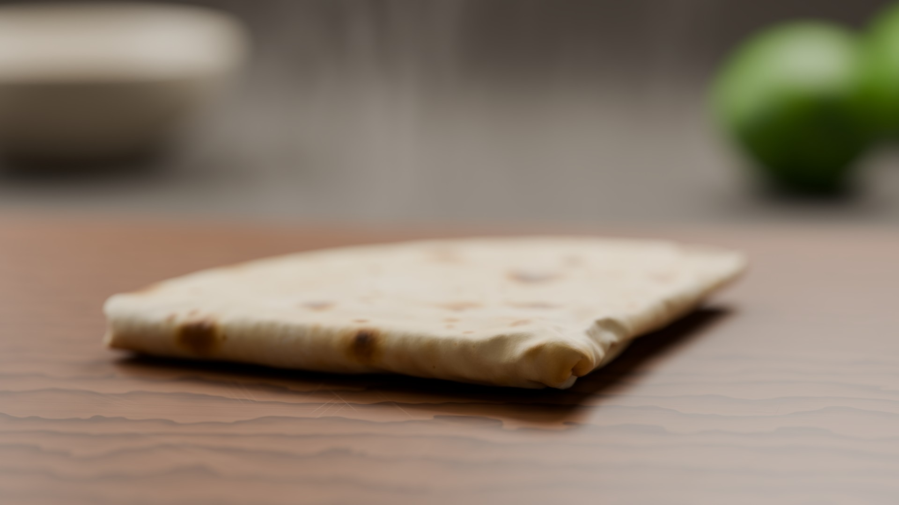

# PROCEDURAL-PHOTOREAL-01 — folded flour tortilla (submission)

## Deliverables
| | |
|---|---|
| D1 script | `build_tortilla.py` (identical to `renders/iter3/build_tortilla_iter3.py`) |
| D2 command | `blender --background --factory-startup --python build_tortilla.py -- --output-dir renders/iter3` (run via `python render.py build_tortilla.py --ttl 90 -- --output-dir renders/iter3`). Without arguments it writes to `output/`. |
| D3 final image | `tortilla_final.png` = `renders/iter3/tortilla_render.png` — 3840×2160, 16-bit PNG |
| D4 .blend | `tortilla_final_scene.blend` = `renders/iter3/tortilla_scene.blend` (saved by the script after baking, before rendering) |
| D5 logs | `cloud_logs/*.log` (full stdout of every cloud run), `cloud_runs.json` (runtime, GPU, exit code). Hardware: NVIDIA RTX 5090 (OptiX), Blender 4.5.13 LTS, Linux. |
| D6 iteration log | `ITERATION_LOG.md` — 3 renders, each with image, script version, critique and changes, plus all bake-only simulation runs |
| D7 summary | below |

Render budget used: **3 of 3**. All other cloud runs were `--bake-only` (cloth simulation + scene build + .blend, no render call).

## Technical summary

**Modeling.** The tortilla is a 22 cm disc built as concentric rings (6k vertices on ring k) with a merge-walk triangulation, giving near-equilateral 3.3 mm triangles (3367 verts) that suit cloth. The rim is made irregular by low-order radial harmonics blended in toward the edge, with sub-millimetre waviness in the rest shape. UVs store the flat rest position so textures follow the cloth through the folds. Thickness: a Solidify modifier at 1.7 mm scaled by a noise vertex group (1.5–1.7 mm, thinner at the rim) gives non-uniform thickness; the second shell gets a separately seeded material for the other side. A cloud-texture Displace adds bubble puffs, then Subdivision smooths. The cutting board is a 48×32×2.2 cm box with rounded corners (10-segment bevel) and 3.5 mm bevelled edges, with sharp/smooth edges set per face. Behind it are a seamless "infinity cove" backdrop, a lathed stoneware bowl and two limes as out-of-focus props.

**Simulation.** Blender cloth with board collision and self-collision, baked in four stages with `ptcache.bake_all`. After each stage its final frame is frozen into the mesh, and the next stage starts from that shape, so the earlier fold persists as rest shape.
1. Fold 1: the whole flap except a narrow hinge band (π × loop radius wide) is pinned and swung through 180° by a hook to an animated empty, about an axis raised by the loop radius. Only the band bends, so it rolls into a round fold instead of buckling.
2. Settle: the flap is released and drapes onto the bottom layer.
3. Fold 2 (both layers): the same method, plus static pins that "hold the other half down" so the inner/outer layer length mismatch stays in the fold.
4. Settle with soft goal springs (weight 0.4) on the flap, so it relaxes without springing up.

Material parameters for a warm tortilla: low bending 0.8, high tension 60, self distance at Blender's 1 mm floor (≈2 mm layer spacing). The finished tortilla is snapped so its lowest point rests 0.15 mm above the board. The development history of about 30 simulation-only bakes, with plots of the exported meshes, is in `ITERATION_LOG.md`.

**Shading** (all procedural node trees).
- **Tortilla:** a domain-warped Voronoi spot system at three scales (large blisters, medium spots, char specks), with per-cell presence/size/intensity, ragged edges and low-frequency density modulation, drives a 7-stop ramp from cream through golden and brown to char. It also has a golden griddle blush, mottling, flour dusting (patch × grain noise, whiter and rougher), random-walk SSS (1.5 mm scale), light sheen, and bump from blisters, grain and flour.
- **Board:** Wave-texture growth rings around a slightly tilted axis below the board, so the grain runs along the long axis with cathedral drift; anisotropic noise for fibers and pores; and knife marks as thin contour lines of strongly stretched noise in six directions, masked to segments and concentrated toward the middle. The finish is satin oil (roughness ≈0.46 plus a light coat).
- **Steam:** a Principled Volume with warped, vertically stretched noise wisps, faded at the top and edges.

**Lighting.** All area lights, with power from the target irradiance (P = E·π·d²): a warm 70×50 cm key softbox from back-left (≈35° elevation), a large dim fill from front-right, a small warm back/rim light at ≈45° (raised after render 1 to remove board glare), and a glow light on the backdrop. The world is a procedural gradient (no HDRI).

**Camera & render.** 85 mm, f/4 (f/2.8 in render 1), 46 cm away, about 12° pitch, low over the board. Focus is set to the nearest point of the tortilla (the leading folded corner) + 4 mm, computed from the evaluated mesh; the background props fall into strong bokeh. Cycles uses OptiX GPU with automatic CUDA/HIP/oneAPI/Metal → CPU fallback, up to 1024 adaptive samples, OIDN denoising with albedo+normal passes, AgX Medium High Contrast at +0.35 EV, and fixed seed 7. The output is a 16-bit PNG at 3840×2160.

**Script structure.** Logged steps with timestamps; any exception prints a traceback and exits with code 1. The output dir and resolution/samples/seed are CLI arguments after `--`. `--bake-only` skips rendering, and `--cloth KEY=VALUE` / `--stages` exist for diagnostics. Only the standard library and bpy/mathutils/bmesh are used, with no external assets.

## Known shortcomings of the final image
- The top surface is still somewhat pale; more browning would read more "griddle-fresh".
- The stack (15 mm) is thicker than a real quartered tortilla, because the second flap rests on the fold-1 bulb with a visible gap.
- The out-of-focus wood grain reads slightly like ripples, and a few knife-mark glints remain in the foreground.
